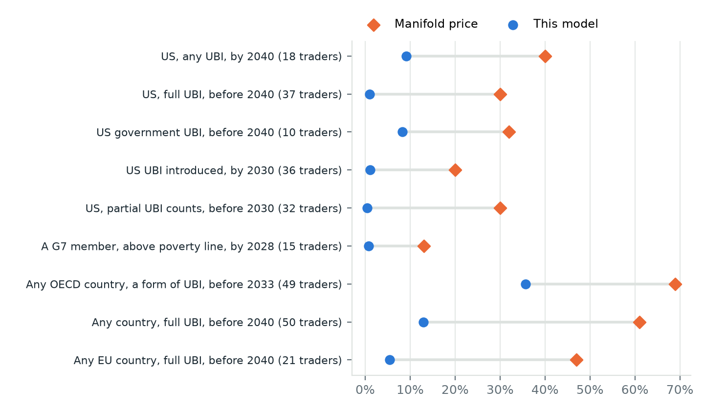
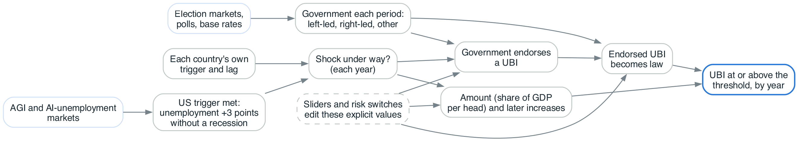
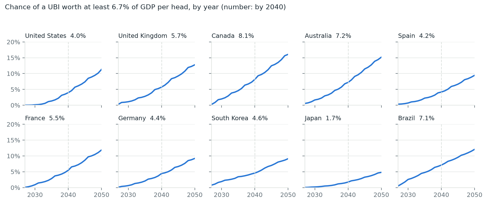
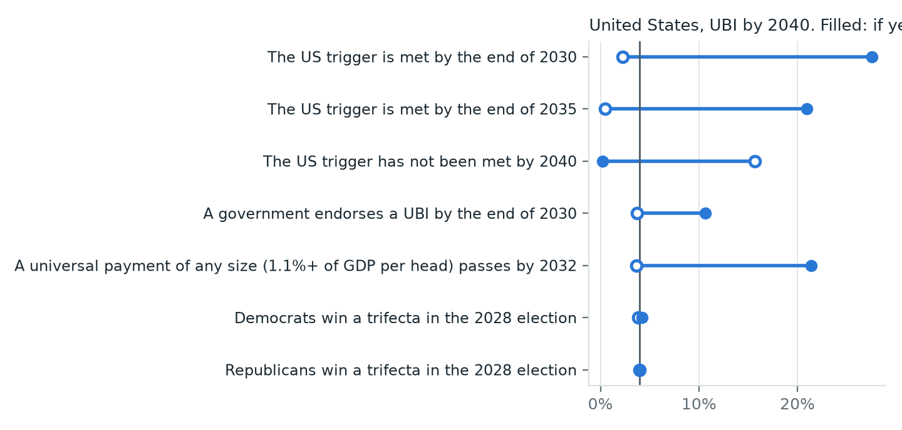

# Introduction

At least eight Manifold markets created by other people ask when, or whether, the United States will adopt a universal basic income. The most active has  traders and puts a "full UBI" before 2040 at . A sibling market run by the same creator, which counts a partial UBI, gives the same  for 2030, a decade sooner. Neither states an amount. Two "any country" markets resolved YES in late 2025, when the Marshall Islands began paying every resident citizen, which says more about definitions than about the United States.

This paper replaces one hard question with several easier ones, the move that decomposition-based forecasting recommends [@macgregor2001decomposition; @tetlock2015superforecasting], and it states each easier question so that the world can answer it. Will US unemployment rise three points while the economy keeps growing? Who will hold power after each election? If a party holds power while that happens, will its leader endorse a universal payment? If it endorses one, will it pass? Each of these has a data source and a date, or a stated condition under which it resolves.

The model runs ten countries: the United States, the United Kingdom, Canada, Germany, France, Spain, Japan, South Korea, Australia and Brazil. It powers an interactive dashboard at [maxghenis.com/ubi-forecast](https://maxghenis.com/ubi-forecast/), and every number in this paper comes from the same engine, seed and history count as the dashboard's default view.

Three findings stand out. First, almost the whole forecast depends on a labor shock of a kind the United States has not seen: without one, the chance of a US UBI by 2040 is . Second, amounts matter as much as enactment: South Korea, led by a president who pledged a universal payment in 2022 and has since shelved it, has a  chance of a universal payment of any size by 2040 but  for one worth 6.7% of GDP per head, because its proposals are small. Third, the model makes predictions that resolve soon. It gives  that a US government endorses a UBI by 2030 and  that some government among the ten does. If endorsements arrive much faster or slower than that, the assumptions below are wrong, and the model says which ones.

# What forecasters say now

@fig-markets compares nine open Manifold markets with this model's answer to the nearest question it can express. Every market prices its question above the model's answer, from about twice as high (the OECD market) to more than thirty times.

{#fig-markets}



: Manifold markets and the model's version of each question. {#tbl-markets}

Three features of these markets explain part of the gap. The definitions vary: some count any universal payment, some require one that covers basic living costs, and one counts "a form of UBI". The markets are thin: none has more than 50 traders. And they run to 2033 or 2040, which ties up traders' currency for years, so a mispriced long-dated market can sit uncorrected. Play money is not obviously the problem: over 208 NFL games, a play-money market forecast as well as a real-money one [@servanschreiber2004prediction]. Long-shot outcomes, though, tend to be overpriced in betting markets [@snowberg2010explaining; @wolfers2004prediction], and a UBI by 2030 is a long shot.

I created five related Manifold markets on 29 September 2026 (US Eastern time), three of them seeded at revision 1's odds; @tbl-markets omits them because they are not an independent check.

Real-money markets say little about UBI directly. Neither Polymarket nor Kalshi lists one. The closest Kalshi contract, on whether a million Americans receive at least $100 under a new federal "dividend" program before 2027, traded at about 5%.

# The question

The model forecasts the year a country enacts a national law paying every adult citizen a recurring, unconditional cash amount at or above a threshold. Three choices define it.

*Enactment*, the date a law passes, is the event, because it is observable and unambiguous; payments can start later.

*Universal and unconditional* rules out means-tested floors, work requirements and child benefits. A tax that claws the payment back from higher earners is allowed, since the payment itself goes to everyone [@hoynes2019universal].

*The threshold is a share of GDP per head*, so it means the same thing across countries. The default, 6.7%, equals $6,000 a year in the United States, whose 2025 GDP per head was . The dashboard offers 1.1%, the smallest program the model counts, up to 25%.

# The model

@fig-model shows the structure. Each simulated history draws every input from its prior range, a PERT distribution over a lowest, most likely and highest value [@malcolm1959application; @clark1962pert], then walks year by year from 2027 to 2050.

{#fig-model}

## The trigger

The model's labor shock is a measurable event. The US trigger is met in the first month in which the 12-month average of the BLS unemployment rate is at least 3 points above its lowest level of the previous three years, while real GDP (BEA) never fell more than 1% below its previous peak during that rise; each month is judged on the day BEA first estimates GDP for its quarter. No agency, market or bill uses a rule for an AI labor shock, so this one is assembled from established parts: the rise is measured against a recent low, as in the Sahm recession rule, and the output test is peak-relative. The output test separates jobless growth from an ordinary recession, in which output falls along with employment. In the official records of the ten countries, fifteen rises of 3 points or more occurred (the United States in 1975, 1982, 2009 and 2020; Canada four times; Australia and Spain twice; the United Kingdom, Brazil and South Korea once), and every one for which output data exist came with an output fall of more than 1%, so the rule has never been met: not in the United States since 1951 and not in 395 country-years across the ten. The rule is not specific to AI; any cause of jobless growth would meet it. Because a 12-month average takes one to three years to rise 3 points and the output test blocks shocks that come with an output fall, the market-anchored timing prior is moved 1.5 years later and scaled by 0.6.

The chance the trigger is met by each year is a prior anchored to markets on artificial general intelligence and AI-driven unemployment. A 175-trader Manifold market gives 23% to AI pushing US unemployment above 10% before 2030, and a series of AGI markets gives 53% to AGI before 2030 and 72% before 2040. The model discounts both: it needs a shock of a specific size and shape, not AGI as such. Surveys of AI researchers place full automation of labor much later than these markets do [@grace2025thousands], and exposure estimates suggest that large language models touch a large share of tasks without saying how fast employment adjusts [@eloundou2024gpts; @cazzaniga2024genai]. Economic theory allows both outcomes: automation that displaces labor faster than new tasks reinstate it, or complementarity that raises wages [@acemoglu2019automation; @autor2015why; @korinek2024scenarios].

Each other country meets its own trigger, defined the same way on its own unemployment and GDP series, with a probability conditional on the US trigger and a lag in years. The research behind these inputs cites the IMF's estimate that about 60% of advanced-economy jobs are highly exposed to AI [@cazzaniga2024genai].

## Governments

Each country's political calendar is a list of periods. The current government is fixed; each election draws a left-led, right-led or other government. In the United States those are a Democratic trifecta, a Republican trifecta and divided government. Election probabilities come from Polymarket and Manifold where they exist and from recent base rates after that.

## Endorsement and passage

This is where the model replaces "political appetite" with observable steps. In each year, a government without a standing endorsement endorses a UBI with a yearly chance that depends on its type and on whether its country's shock is under way; the ledger states each as a chance per full term in office and the equivalent yearly chance. An endorsement is a public commitment to a national, universal, unconditional, recurring cash payment to all adults, of any amount, made by the head of government (including by signing a law that establishes one), in the election platform of the party that leads the government, or in a coalition agreement. Pilots, means-tested, age-limited or conditional schemes, one-off payments, options lists, party-convention resolutions that never entered a platform, and a junior coalition partner's own program do not count. An endorsement stands until an election hands the head of government to the other side; a US midterm or a Korean Assembly election does not end it. While it stands, the UBI becomes law before the next election with a chance that depends on the current government type: high for a Westminster majority, lower for a US trifecta facing a filibuster or for a coalition, low under divided government. That chance is spread evenly over the years left in the period, starting in the year of endorsement, and applies afresh in each period the endorsement stands, so the stated chance is exactly the chance an endorsed UBI passes before the next election.

Endorsements happen far more often than enactments, so they give the model evidence it can be tested on soon. Both steps test what @dewispelaere2012feasibility call strategic feasibility, whether governing actors will build and use a coalition for a UBI; passage also absorbs institutional feasibility, whether existing institutions allow one to be implemented. History warns that a willing government is not enough. Nixon's Family Assistance Plan had broad support and failed [@steensland2008failed].

Shock-driven endorsements begin one to three years after a country's trigger is met.

## Amounts

When a UBI passes, its first-year amount is drawn relative to GDP per head from a lognormal centered on the country's prior: without a shock it is near a dividend's scale in the United States and near existing minimum-income benefits in most other countries (8 to 11% of GDP per head), and it is larger during one. During a shock, a left- or right-led government reconsiders an existing program's amount with a set chance each year and raises it when a fresh draw is larger.

## Risks

Four switches change explicit inputs. A fiscal squeeze multiplies passage chances by 0.6 and amounts by 0.85. "Means-tested route wins" multiplies endorsement chances by 0.6 in normal times and 0.8 during a shock. Policy diffusion multiplies every other government's endorsement chance by 1.5 once any of the ten enacts. Gridlock multiplies passage by 0.3 for divided governments, cross-bloc coalitions and hung parliaments.

## What the output means

A forecast is the share of histories in which the event happens. Every history carries its own draw of the inputs, so that share already averages over what we do not know about them, and the paper reports no interval around it. What we do not know shows up instead as signposts: for an observable event $S$, the forecast if $S$ happens and if it does not. By the law of total probability these average back to today's forecast, $P(U) = P(S)\,P(U \mid S) + P(\neg S)\,P(U \mid \neg S)$ [@blitzstein2019introduction], which is conservation of expected evidence [@yudkowsky2007conservation]. The identity holds by construction for any signpost, and a property test checks it. Conditioning on $S$ means keeping the histories where $S$ holds.

Election, midterm and exposure inputs each feed a single yes-or-no draw per history, so the engine uses their means, which gives the same distribution except where a country's left-led and right-led chances can sum above 0.98 and the cap is applied to the means. Endorsement, passage, amount, lag and timing inputs are drawn once per history and shared across its years, so their full ranges matter.

# Inputs and evidence

For each country, a research agent gathered the government, election calendar, party positions on basic income, polling, existing programs and election markets. A second agent re-fetched the sources for 332 claims: 264 held, 42 needed corrections, 7 were wrong and 19 could not be checked. A later pass re-checked each of the 37 facts that the dashboard shows against its own link; 16 were fully supported and 21 were trimmed, split or re-sourced. @tbl-inputs summarizes the priors.



: Political priors by country (means). Election columns give left-led and right-led chances after the next election. Endorsement and passage chances are per term of the length shown. {#tbl-inputs}



: Trigger and amount priors by country. Each country's trigger applies the same rule to its own official unemployment and GDP series, named in the dashboard's ledger. {#tbl-trigger}

Public opinion enters through judgment. In the 2016 European Social Survey, support for a basic income ranged from about a third to four-fifths across countries [@roosma2020public], and was broadest where social spending is lowest, the countries least able to afford one [@parolin2020support]. Individual exposure to automation has not predicted support [@dermont2020automation], so the model gives no weight to exposure before a shock arrives.

Evidence on effects enters only through feasibility. Finland's experiment had no detectable effect on employment in its first year [@verho2022removing], though recipients reported better wellbeing [@kangas2021feasibility]; the OpenResearch trial found moderate reductions in work, with labor-force participation down 4.2 points [@vivalt2024employment]; Alaska's dividend has not reduced employment [@jones2022labor]; and Iran's near-universal transfers did not reduce labor supply [@salehiisfahani2018cash]. None of these settles the fiscal question that dominates political debate in advanced countries [@hoynes2019universal; @kangas2021feasibility], or the targeting question in poorer ones [@banerjee2019universal].

# Results

## Ten countries



: Chance of a national UBI worth at least 6.7% of GDP per head. "Any size" counts the smallest qualifying program. The last column conditions on the US trigger not being met by 2040. {#tbl-countries}

{#fig-countries}

Canada ( by 2040), Australia (), Brazil () and the United Kingdom () lead, and the United States is at ; @tbl-countries gives the rest. At least one of the ten gets there with probability  by 2040 and  by 2050. The countries move together because they share one trigger timing.

## The trigger carries the forecast



: Signposts for a US UBI worth at least 6.7% of GDP per head by 2040. {#tbl-signposts}

{#fig-signposts}

If the US trigger is met by 2030, the US forecast for 2040 rises to ; if it has not been met by 2040, the forecast falls to . A US government endorsing a UBI by 2030 moves the forecast to . Who wins the 2028 election matters far less: a Democratic trifecta gives  against  otherwise, because without a shock even a trifecta rarely endorses.

## Size matters

The threshold changes the answer. The United States has  by 2040 for a universal payment of any size against  at 6.7% of GDP per head and  at 15%. South Korea shows the pattern most clearly:  for any size and  at 6.7%, since the proposals of its president's government have been worth about 2% of GDP per head.

## Sensitivity



: The chance by 2040 under alternative assumptions, each from 100,000 histories (so the default row can differ slightly from the 200,000-history figures elsewhere). Each row changes explicit inputs; the dashboard shows the resulting values. {#tbl-scenarios}

Endorsement, passage and amounts are levers of similar size for the United States. Doubling how often an endorsed UBI becomes law raises the US forecast to ; halving it cuts the forecast to . Doubling how often left-led governments endorse raises it to . Moving the US trigger five years later cuts it to , and halving amounts cuts it to , because fewer programs clear the $6,000 bar.

# What would prove it wrong

Every input is a proposition that can turn out false. @tbl-soon lists the predictions that resolve first.



: Near-term predictions. Triggers resolve from each country's official statistics; endorsements from statements, platforms and coalition agreements; enactment from statute. {#tbl-soon}

The trigger probabilities resolve every December. The model gives  that the US trigger is met by the end of 2028 and  by 2030; if the trigger arrives much earlier, the AI-market anchors were too pessimistic about timing. The endorsement probabilities are the sharpest test:  that some government among the ten endorses a qualifying UBI by 2030. An endorsement without a trigger would say the no-shock priors are too low; several endorsements after a trigger with no passage would say the passage priors are too high.

The conditional inputs resolve only when their condition occurs. "A left-led government holding power during a shock endorses a UBI at a given yearly rate" cannot be tested until such a government faces such a shock. The dashboard's ledger lists each one with its condition, and scores will be added as they resolve.

# Validation

The ten-country engine is JavaScript, so that the dashboard can run it in a browser. A separate Python implementation of the US model serves as a reference, and a differential test requires the two to agree within five Monte Carlo standard errors at 2032, 2036, 2040, 2045 and 2050. The JavaScript run of  histories gives  for the United States by 2040 and the Python run of  gives .

Property-based tests, written with fast-check and Hypothesis, check invariants for randomized priors on two inputs and arbitrary controls. Probabilities are cumulative in time, nested by amount threshold and by country set, and every signpost averages back to today's forecast. No enactment comes before the first endorsement, and a stated passage chance is the realized chance that an endorsed UBI becomes law before the next election, for periods of two to five years. No endorsements means no UBI, and no passage means endorsements but no UBI. Each country and each history has its own random stream, so a change to one country's inputs leaves the others' results unchanged, unless the policy-diffusion risk is on.

# Limitations

Elections and the trigger are independent in the model, though a labor shock would likely move elections; if incumbents lose markedly more often after a trigger, that assumption fails. Three government types compress real coalitions. No-shock endorsement rates are fitted to the record; shock-state endorsement and passage priors are judgments informed by the base rates in the ledger, because no country has enacted a qualifying UBI at scale. The model does not include repeal, the threshold ignores differences in existing benefits, and the ten countries omit Italy and every country outside the OECD except Brazil.

Theory gives reason for doubt about the premise itself. Task-based models let new work absorb displaced labor [@acemoglu2019automation], one careful estimate puts AI's ten-year productivity effect below 1% [@acemoglu2025simple], and past automation left most jobs standing [@autor2015why]. If none of the ten countries meets its trigger by 2040, the model's own signposts say a UBI is unlikely there by then.

# Conclusion

The question "when will the US adopt a universal basic income?" has a simple structural answer: when a labor shock arrives that leaves output growing and employment falling, and a government that has endorsed a universal payment holds enough power to pass one. The model puts that at  by 2040 for a payment worth $6,000 a year, below every market that asks a similar question. It will be tested before 2040. Each December, the trigger either has or has not been met, and each election and party platform either does or does not produce an endorsement. Metaculus's [Radiant](https://radiant.metaculus.com) maps the predictions behind a decision as linked boxes [@metaculus2026radiant]; this paper builds such a map and requires that each box resolve.

# Revisions {.appendix}

The first version of this model, dated 29 September and published on the dashboard on 30 September 2026, put a US UBI worth $6,000 a year at 9.6% by 2040. It collapsed endorsement and passage into one per-term enactment chance and scaled it with a single "political appetite" multiplier that no observation could contradict. This version splits enactment into the two observable steps above, states passage as the chance of becoming law before the next election, replaces the unemployment-level trigger (which, as a pre-publication review found, would have been met in ordinary recession recoveries) with one that has never been met, and fits the no-shock endorsement rates to a verified record of every government since 2000. That record has four new endorsements: Brazil in 2004, 2021 and 2023, when presidents of both sides signed laws describing their programs as steps toward a universal basic income, and South Korea's governing party in 2022. The versions differ in structure, trigger and priors at once, so the change in the headline is not attributed to any one of them.

# Reproducibility {.appendix}

Code, research, tests and this paper's sources are at [github.com/MaxGhenis/ubi-forecast](https://github.com/MaxGhenis/ubi-forecast). `paper/scripts/results.mjs` runs the dashboard's engine with seed  and writes every number in this paper; `paper/scripts/build_assets.py` turns them into the variables, tables and figures used above.

# References {.unnumbered}

::: {#refs}
:::
